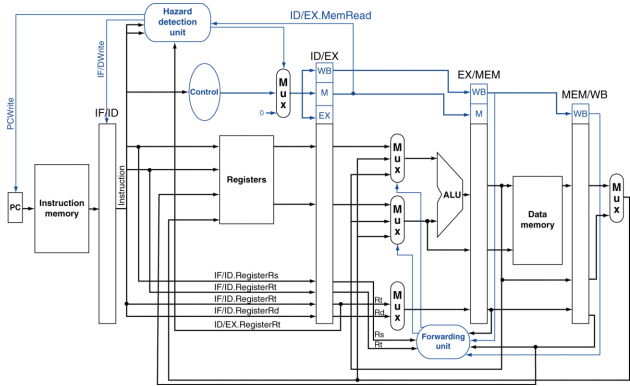

# Pipelined MIPS Processor

## Overview

This project implements a pipelined MIPS processor as described in the documents provided. The processor is designed to efficiently execute MIPS assembly instructions using a five-stage pipeline architecture. This README file provides an overview of the design, its key features, and instructions for setting up and using the processor.

## Architecture

The pipelined MIPS processor is divided into the following five stages:

1. **Instruction Fetch (IF)**
2. **Instruction Decode (ID)**
3. **Execution (EX)**
4. **Memory Access (MEM)**
5. **Write Back (WB)**

The architecture diagram below provides a detailed view of how these stages are connected:



### Key Components:

- **Instruction Memory:** Stores the instructions to be executed by the processor.
- **Registers:** A set of registers used to store data and instructions during execution.
- **ALU (Arithmetic Logic Unit):** Performs arithmetic and logical operations.
- **Data Memory:** Stores data that can be read from or written to during program execution.
- **Control Unit:** Manages the control signals for the processor to ensure correct data flow and operation.
- **Forwarding Unit & Hazard Detection Unit:** These units handle data hazards and ensure correct operation during instruction pipelining.

For a more detailed explanation of the architecture and the control signals used, please refer to the [Pipelined MIPS Processor](./Pipelined%20MIPS%20Processor.pdf) document.

## Pipeline Stages

### Instruction Fetch (IF)
- Fetches the instruction from the instruction memory using the program counter (PC).

### Instruction Decode (ID)
- Decodes the fetched instruction and reads the necessary registers.

### Execution (EX)
- Executes the instruction using the ALU.

### Memory Access (MEM)
- Accesses data memory for load and store instructions.

### Write Back (WB)
- Writes the result back to the register file.

## Hazard Handling

The processor includes mechanisms to handle various types of hazards:

- **Data Hazards:** Managed by the Forwarding Unit, which forwards data between pipeline stages.
- **Control Hazards:** Managed by stalling or by using branch prediction techniques.
- **Structural Hazards:** Avoided by careful resource allocation, ensuring no two stages compete for the same hardware resource.

Details on hazard management can be found in the [hardware_diagram](./hardware_diagram.pdf) document.

## Setup and Usage

### Prerequisites
- A basic understanding of MIPS assembly language and computer architecture.
- Tools required for simulation or implementation, such as a hardware description language (HDL) simulator or FPGA board.

### How to Run
1. Clone the repository:
    ```bash
    git clone https://github.com/your-username/pipelined-mips-processor.git
    cd pipelined-mips-processor
    ```
2. Follow the instructions in the simulation or synthesis directory to compile and run the processor.

### Testing
- Example test programs in MIPS assembly are provided in the `tests/` directory.
- Run the provided test cases to verify the correct operation of the processor.

## Contributions

Feel free to open issues or submit pull requests. Contributions to enhance the processor, add features, or improve documentation are welcome.

## License

This project is licensed under the MIT License. See the `LICENSE` file for more details.

---
